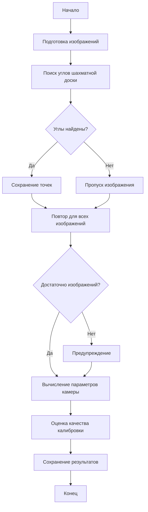

# camera_calibrate

Проект для калибровки обычных и fisheye камер с использованием шахматной доски. Проект предоставляет инструменты для:
- Калибровки обычных камер
- Калибровки fisheye камер
- Исправления дисторсии изображений
- Визуализации и оценивания результатов калибровки
- Использования через API, CLI и напрямую через main.py

## Структура проекта

```
camera_calibrate/
├── calibrators/
│   ├── __init__.py
│   ├── base_calibrator.py
│   ├── camera_calibrator.py           # Калибратор для обычных камер
│   └── fisheye_calibrator.py          # Калибратор для fisheye камер
├── utils/                             # Утилиты (логирование, генерация шахматных досок и др.)
├── calibration_images/                # Изображения для обычной калибровки
├── fisheye_calibration_images/        # Изображения для fisheye-калибровки
├── logs/
├── docs/                              # Документация
├── __init__.py                        # Корневой экспорт API
├── cli.py                             # CLI-интерфейс
├── constants.py                       # Константы и пути
├── main.py                            # Универсальная точка входа (CLI)
├── setup.py
├── pyproject.toml
├── README.md
├── README_API.md
└── requirements.txt
```

## Основные константы путей
- `PATH_TO_CALIBRATE_IMG` — абсолютный путь к папке с изображениями для обычной калибровки
- `PATH_TO_CALIBRATE_FISHEYE_IMG` — абсолютный путь к папке с изображениями для fisheye-калибровки

## Процесс калибровки



## Типы данных

### Основные параметры калибровки
- `camera_matrix`: np.ndarray — Матрица камеры (3x3)
- `dist_coeffs`: np.ndarray — Коэффициенты дисторсии
- `rvecs`: List[np.ndarray] — Векторы поворота
- `tvecs`: List[np.ndarray] — Векторы перемещения
- `image_size`: Tuple[int, int] — Размер изображения

### Параметры fisheye камеры
- `k1`, `k2`, `k3`, `k4`: float — Коэффициенты дисторсии fisheye
- `fov_x`, `fov_y`: float — Поле зрения по горизонтали и вертикали

## Зависимости

```
numpy>=1.21.0
opencv-python>=4.5.0
```

## Установка

1. Создайте виртуальное окружение:
```bash
python -m venv .venv
```

2. Активируйте виртуальное окружение:
- Windows:
```bash
.venv\Scripts\activate
```
- Linux/Mac:
```bash
source .venv/bin/activate
```

3. Установите зависимости:
```bash
pip install -r requirements.txt
```

## Использование

### 1. Запуск через main.py (универсальный CLI)

```bash
python main.py --mode fisheye --images fisheye_calibration_images/
python main.py --mode normal --images calibration_images/
```
- `--mode` — тип калибровки: `normal` (обычная) или `fisheye` (по умолчанию fisheye)
- `--images` — путь к папке с изображениями

### 2. Запуск через CLI-интерфейс (cli.py)

```bash
python -m camera_calibrate.cli regular --images calibration_images/ --output camera_calibration.npz
python -m camera_calibrate.cli fisheye --images fisheye_calibration_images/ --output fisheye_calibration.npz
```

### 3. Использование как библиотеки (API)

#### Импорт из корня (универсальный способ)
```python
from camera_calibrate import calibrators, utils, constants

logger = utils.setup_logger()
calibrator = calibrators.CameraCalibrator(logger)
calibrator.calibrate_from_images("calibration_images/")
calibrator.save_calibration("camera_calibration.npz")

fisheye_calibrator = calibrators.FisheyeCalibrator(logger)
fisheye_calibrator.calibrate_from_images("fisheye_calibration_images/")
fisheye_calibrator.save_calibration("fisheye_calibration.npz")
```

#### Прямой импорт классов и функций
```python
from camera_calibrate.calibrators import CameraCalibrator, FisheyeCalibrator
from camera_calibrate.utils import setup_logger, create_chessboard, get_image_files
from camera_calibrate.constants import DEFAULT_PATTERN_SIZE, SUPPORTED_IMAGE_FORMATS
```

## Результаты калибровки

После успешной калибровки будут сохранены следующие параметры:
- Матрица камеры (внутренние параметры):
  - fx, fy: фокусное расстояние
  - cx, cy: координаты главной точки
- Коэффициенты дисторсии:
  - Для обычной камеры: k1, k2, p1, p2, k3
  - Для fisheye камеры: k1, k2, k3, k4
- Размер изображения
- Оценка качества калибровки

## Методы исправления дисторсии

### Для обычной камеры
- Стандартное исправление дисторсии

### Для fisheye камеры
- Equirectangular projection (хорошо для панорам)
- Perspective projection (как обычная камера)
- Cylindrical projection (хорошо для широких сцен)
- Stereographic projection (сохраняет углы)

## Логирование

Все этапы калибровки логируются в директорию `logs/` с указанием:
- Успешности поиска углов на каждом изображении
- Параметров калибровки
- Оценки качества калибровки
- Ошибок и предупреждений

## Примечания

### Требования к изображениям
- Для качественной калибровки рекомендуется использовать не менее 10-15 изображений
- Для fisheye-камер — не менее 15 изображений
- Шахматная доска должна быть хорошо освещена и не иметь бликов
- Изображения должны быть сделаны под разными углами
- Для fisheye камер рекомендуется захватить как можно больше углов доски

### Рекомендации по калибровке
- Используйте шахматную доску с четкими углами
- Делайте снимки под разными углами и расстояниями
- Избегайте размытия и движения камеры
- Для fisheye камер старайтесь захватить как можно больше углов доски

### Оценка качества
- Отличное качество: ошибка < 0.5 пикселей
- Хорошее качество: ошибка < 1.0 пикселей
- Приемлемое качество: ошибка < 2.0 пикселей
- Низкое качество: ошибка > 2.0 пикселей


## Автор
[Nadezhda Shiryaeva] — [sns0898@mail.ru]

Изображения calibration_images/right*.jpg взяты с [opencv](https://github.com/opencv/opencv/tree/master/samples/data)
