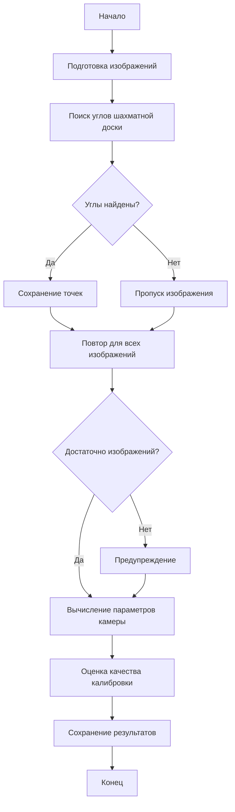

 # Сamera_calibrate

Проект для калибровки обычных и fisheye камер с использованием шахматной доски. Проект предоставляет инструменты для:
- Калибровки обычных камер
- Калибровки fisheye камер
- Исправления дисторсии изображений
- Визуализации результатов калибровки

## Структура проекта

```
camera_calibrate/
├── camera_calibrator.py          # Калибратор для обычных камер
├── fisheye_camera_calibrator.py  # Калибратор для fisheye камер
├── main.py                       # Основной скрипт запуска
├── logger_config.py              # Конфигурация логирования
├── calibration_images/           # Изображения для калибровки обычных камер
├── fisheye_calibration_images/   # Изображения для калибровки fisheye камер
└── logs/                         # Директория для логов
```

## Процесс калибровки


## Типы данных

### Основные параметры калибровки
- `camera_matrix`: np.ndarray - Матрица камеры (3x3)
- `dist_coeffs`: np.ndarray - Коэффициенты дисторсии
- `rvecs`: List[np.ndarray] - Векторы поворота
- `tvecs`: List[np.ndarray] - Векторы перемещения
- `image_size`: Tuple[int, int] - Размер изображения

### Параметры fisheye камеры
- `k1`, `k2`, `k3`, `k4`: float - Коэффициенты дисторсии fisheye
- `fov_x`, `fov_y`: float - Поле зрения по горизонтали и вертикали


## Зависимости

```
numpy>=1.21.0
opencv-python>=4.5.0
```

## Установка

1. Создайте виртуальное окружение:
```bash
python -m venv .venv
```

2. Активируйте виртуальное окружение:
- Windows:
```bash
.venv\Scripts\activate
```
- Linux/Mac:
```bash
source .venv/bin/activate
```

3. Установите зависимости:
```bash
pip install -r requirements.txt
```

## Использование

1. Подготовьте набор изображений шахматной доски:
   - Для обычной камеры: поместите в папку `calibration_images/`
   - Для fisheye камеры: поместите в папку `fisheye_calibration_images/`

2. Запустите калибровку:
```bash
python main.py
```

## Результаты калибровки

После успешной калибровки будут сохранены следующие параметры:
- Матрица камеры (внутренние параметры):
  - fx, fy: фокусное расстояние
  - cx, cy: координаты главной точки
- Коэффициенты дисторсии:
  - Для обычной камеры: k1, k2, p1, p2, k3
  - Для fisheye камеры: k1, k2, k3, k4
- Размер изображения
- Оценка качества калибровки

## Методы исправления дисторсии

### Для обычной камеры
- Стандартное исправление дисторсии

### Для fisheye камеры
- Equirectangular projection (хорошо для панорам)
- Perspective projection (как обычная камера)
- Cylindrical projection (хорошо для широких сцен)
- Stereographic projection (сохраняет углы)

## Логирование

Все этапы калибровки логируются в директорию `logs/` с указанием:
- Успешности поиска углов на каждом изображении
- Параметров калибровки
- Оценки качества калибровки
- Ошибок и предупреждений

## Примечания

### Требования к изображениям
- Для качественной калибровки рекомендуется использовать не менее 10-15 изображений
- Шахматная доска должна быть хорошо освещена и не иметь бликов
- Изображения должны быть сделаны под разными углами
- Для fisheye камер рекомендуется использовать больше изображений (15-20)

### Рекомендации по калибровке
- Используйте шахматную доску с четкими углами
- Делайте снимки под разными углами и расстояниями
- Избегайте размытия и движения камеры
- Для fisheye камер старайтесь захватить как можно больше углов доски

### Оценка качества
- Отличное качество: ошибка < 0.5 пикселей
- Хорошее качество: ошибка < 1.0 пикселей
- Приемлемое качество: ошибка < 2.0 пикселей
- Низкое качество: ошибка > 2.0 пикселей

# Автор
[Nadezhda Shiryaeva] - [sns0898@gmail.com]